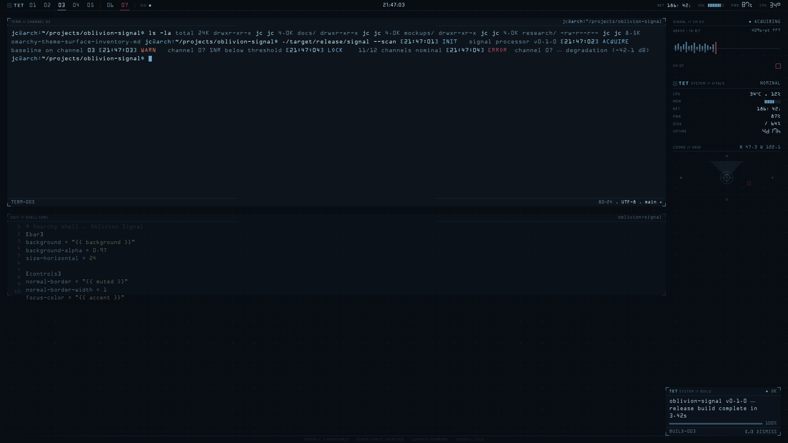
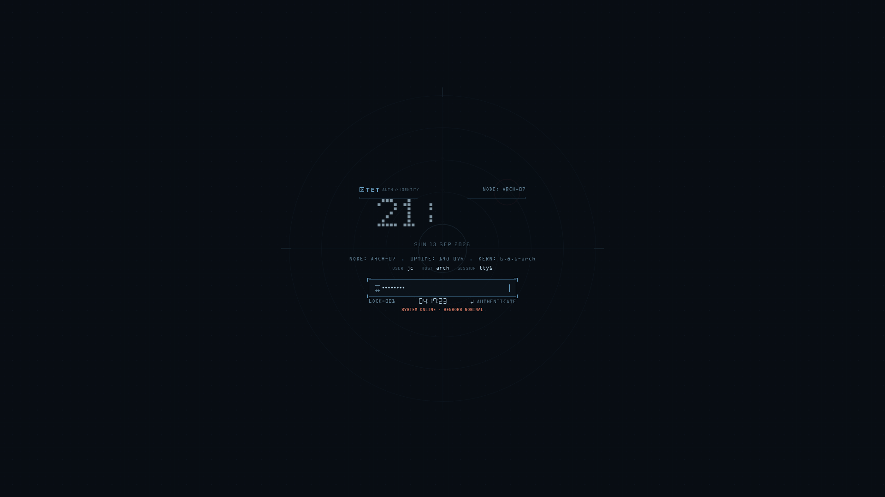

# Oblivion Signal

A dark-only [Omarchy](https://omarchy.org) theme inspired by the disciplined
instrument language of GMUNK's *Oblivion* graphics. Blue-slate void,
one-pixel steel-blue active borders, structural rules, dusty crimson
exceptions, and an 18px dot lattice that is noticed after the information,
not before it.




## Install

```bash
omarchy theme install https://github.com/joaomcarlos/omarchy-oblivion-signal-theme
```

`omarchy theme install` derives the theme name from the repository name —
this repo must be cloned as `omarchy-oblivion-signal-theme` (or
`oblivion-signal-theme`, `oblivion-signal`) for the theme to install as
`oblivion-signal`. The optional hook below also checks for that name.

### Full window treatment (recommended)

Omarchy strips `*.lua` files from themes installed from a git repo and
regenerates `hyprland.lua` from `colors.toml`. That keeps the border
colors but loses this theme's one-pixel borders, square corners, and
mechanical animation curves. To get the full treatment, make the installed
copy a "user theme" by removing its `.git` directory, then re-apply:

```bash
rm -rf ~/.config/omarchy/themes/oblivion-signal/.git
omarchy theme set oblivion-signal
```

### Optional: font, GTK and icon automation hook

The theme's finishing touches live in a `theme-set` hook at
`hooks/theme-set.d/oblivion-signal`. Install it with:

```bash
omarchy hook install theme-set hooks/theme-set.d/oblivion-signal
```

When Oblivion Signal is applied, the hook:

- switches the `monospace` font alias to **OCRA** (the film's telemetry
  voice) — install any OCR-A font that resolves to family `OCRA`
  (`fc-match OCRA`) first, e.g. from the AUR;
- installs `gtk.css` to `~/.config/gtk-4.0/` and `gtk3.css` to
  `~/.config/gtk-3.0/`, backing up any files already there;
- links `icons/oblivion-signal` into `~/.local/share/icons/` and rebuilds
  the icon cache;
- sets the Adwaita cursor theme, which suits the instrument look.

On switching to any other theme it restores the previous font, GTK CSS
files and cursor theme.

### Icon theme

`icons.theme` names `oblivion-signal`, a custom icon theme shipped in
`icons/oblivion-signal/` — thin monoline steel-blue glyphs covering the
file-manager surfaces (folders with per-type emblems, home, trash, drives,
mimetypes, dialogs) plus `-symbolic` sidebar sizes and a handful of app
glyphs. The automation hook above links it into place; to do it manually:

```bash
ln -sfn ~/.config/omarchy/themes/oblivion-signal/icons/oblivion-signal ~/.local/share/icons/oblivion-signal
gtk-update-icon-cache -f ~/.local/share/icons/oblivion-signal
```

`Inherits=Papirus-Dark,hicolor` covers every icon this set does not draw,
so install
[papirus-icon-theme](https://github.com/PapirusDevelopmentTeam/papirus-icon-theme)
(`pacman -S papirus-icon-theme`, or extract a release tarball into
`~/.local/share/icons/`) as the fallback layer. Folders there are recolored
to nordic blues with `papirus-folders -C nordic -t Papirus-Dark`.

### Boot surfaces (optional, need sudo)

`limine/limine.conf` recolors the Limine boot menu to the palette
(branding `OBLIVION SIGNAL`, steel-blue UI, dusty crimson errors). Merge
its palette/branding lines into `/boot/limine.conf` (or wherever your
Limine config lives) and run `omarchy-refresh-limine`.

Plymouth boot splash:

```bash
omarchy plymouth set '#0D141C' '#B5D2E3' ~/.config/omarchy/themes/oblivion-signal/plymouth/logo.png
```

## Files

| File | Purpose |
| --- | --- |
| `colors.toml` | Palette and semantic color roles |
| `shell.toml` | Shell surface overrides — bar, controls, popups, notifications, launcher, lock, spacing |
| `hyprland.lua` | Hyprland treatment — 1px cyan active border, teal inactive, no shadows, mechanical animations (stripped by `omarchy theme install`; see above) |
| `icons.theme` | Icon theme name (`oblivion-signal`) |
| `icons/oblivion-signal/` | Custom monoline icon set, inherits Papirus-Dark |
| `gtk.css` / `gtk3.css` | libadwaita / GTK3 overrides, installed by the theme-set hook |
| `btop.theme` | btop color scheme |
| `chromium.theme` | Chromium browser tint |
| `limine/limine.conf` | Bootloader palette + branding |
| `plymouth/logo.svg` / `.png` | Boot splash reticle mark |
| `backgrounds/` | Wallpaper — dot lattice, faint reticle, signal trace, coordinate marks (+ SVG source) |
| `preview.png` / `preview-unlock.png` | Theme picker previews |
| `hooks/theme-set.d/oblivion-signal` | Optional automation hook (font, GTK CSS, icons, cursor) |

## Palette

| Role | Color | Use |
| --- | --- | --- |
| Void | `#080D13` / `#0D141C` | Desktop ground, inactive space |
| Structural slate | `#2C4A61` | Quiet rules, inactive ticks, grid structure |
| Muted data | `#5F7F93` | Secondary labels, non-active readings |
| Steel ice-blue | `#6FA8CC` | Selection, focus, live datum, active border |
| Bright readout | `#B5D2E3` / `#A3CFE3` | Primary text, hero value |
| Dusty crimson | `#A6455C` / `#C4705C` | Anomaly, limit, urgent action only |
| Caution | `#D8D9A8` | Occasional warning datum; never a general accent |

## License

MIT — see [LICENSE](LICENSE).
