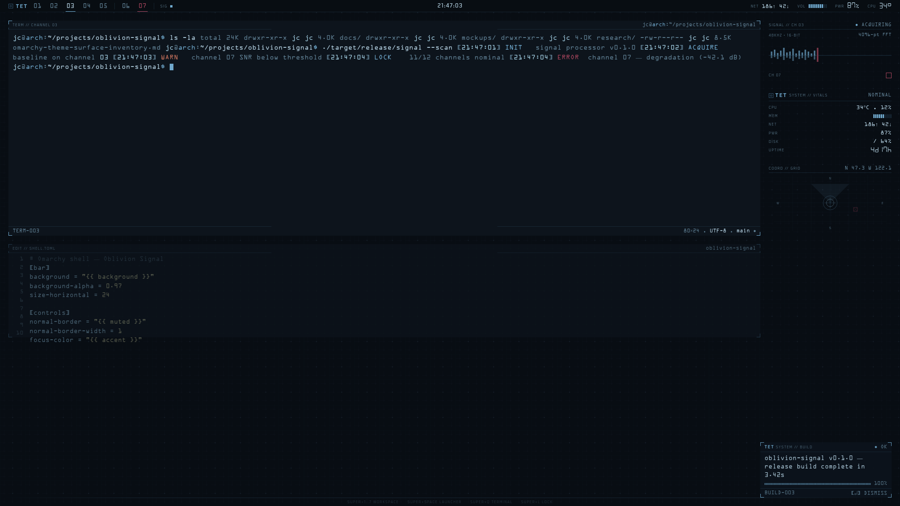
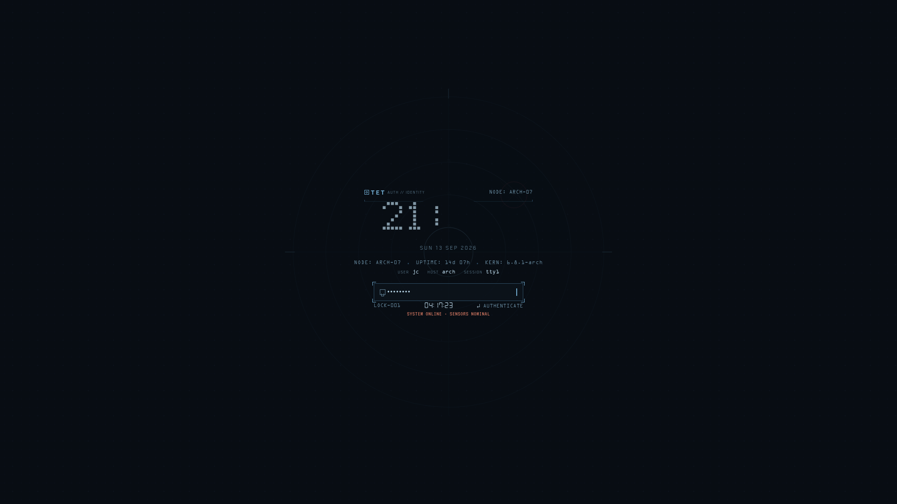

# Oblivion Signal

A dark-only [Omarchy](https://omarchy.org) theme inspired by the disciplined
instrument language of GMUNK's *Oblivion* graphics. Blue-slate void,
one-pixel steel-blue active borders, structural rules, dusty crimson
exceptions, and an 18px dot lattice that is noticed after the information,
not before it.




## Install

```bash
omarchy theme install https://github.com/joaomcarlos/omarchy-oblivion-signal-theme
```

`omarchy theme install` derives the theme name from the repository name —
this repo must be cloned as `omarchy-oblivion-signal-theme` (or
`oblivion-signal-theme`, `oblivion-signal`) for the theme to install as
`oblivion-signal`. The optional hook below also checks for that name.

### Full window treatment (recommended)

Omarchy strips `*.lua` files from themes installed from a git repo and
regenerates `hyprland.lua` from `colors.toml`. That keeps the border
colors but loses this theme's one-pixel borders, square corners, and
mechanical animation curves. To get the full treatment, make the installed
copy a "user theme" by removing its `.git` directory, then re-apply:

```bash
rm -rf ~/.config/omarchy/themes/oblivion-signal/.git
omarchy theme set oblivion-signal
```

### Optional: font, GTK and icon automation hook

The theme's finishing touches live in a `theme-set` hook at
`hooks/theme-set.d/oblivion-signal`. Install it with:

```bash
omarchy hook install theme-set hooks/theme-set.d/oblivion-signal
```

When Oblivion Signal is applied, the hook:

- switches the `monospace` font alias to **OCRA** (the film's telemetry
  voice) — install any OCR-A font that resolves to family `OCRA`
  (`fc-match OCRA`) first, e.g. from the AUR;
- installs `gtk.css` to `~/.config/gtk-4.0/` and `gtk3.css` to
  `~/.config/gtk-3.0/`, backing up any files already there;
- links `icons/oblivion-signal` into `~/.local/share/icons/` and rebuilds
  the icon cache;
- sets the Adwaita cursor theme, which suits the instrument look;
- links the `oblivion.workspaces` shell plugin into
  `~/.config/omarchy/plugins/` and swaps it into the bar slot of the stock
  workspaces widget (zero-padded readouts, underline on the focused cell,
  coral flicker on urgent workspaces);
- adds a marked `quickshell -p` autostart block to
  `~/.config/hypr/autostart.lua` and launches the telemetry rail (below).

On switching to any other theme it restores the previous font, GTK CSS
files and cursor theme, swaps the stock workspaces widget back, removes
the plugin link, stops the rail, and removes its autostart block.

### Icon theme

`icons.theme` names `oblivion-signal`, a custom icon theme shipped in
`icons/oblivion-signal/` — thin monoline steel-blue glyphs covering the
file-manager surfaces (folders with per-type emblems, home, trash, drives,
mimetypes, dialogs) plus `-symbolic` sidebar sizes and a handful of app
glyphs. The automation hook above links it into place; to do it manually:

```bash
ln -sfn ~/.config/omarchy/themes/oblivion-signal/icons/oblivion-signal ~/.local/share/icons/oblivion-signal
gtk-update-icon-cache -f ~/.local/share/icons/oblivion-signal
```

`Inherits=Papirus-Dark,hicolor` covers every icon this set does not draw,
so install
[papirus-icon-theme](https://github.com/PapirusDevelopmentTeam/papirus-icon-theme)
(`pacman -S papirus-icon-theme`, or extract a release tarball into
`~/.local/share/icons/`) as the fallback layer. Folders there are recolored
to nordic blues with `papirus-folders -C nordic -t Papirus-Dark`.

### Telemetry rail (optional)

`rail/` is a standalone [Quickshell](https://quickshell.ca) instance that
draws the right-hand instrument rail inside the workspace `gaps_out`
reservation. It reads the active theme's `colors.toml`, so it follows theme
swaps. Four modules, top to bottom:

- **SIGNAL // CH 03** — a real audio FFT when `cava` is installed
  (`rail/cava.conf`, 48 bars off the PipeWire monitor), falling back to a
  CPU-biased walk without it.
- **TET // SYSTEM // VITALS** — real readings from `rail/poll.sh`: GPU
  (temp + util) and GPU - VRAM, CPU (temp + util) and MEM, NET throughput,
  DISK read/write rates plus usage percent, and UPTIME. GPU rows hide when
  `nvidia-smi` reports nothing.
- **TRACE // LOAD** — a rolling two-minute CPU/MEM trace with NET ticks.
- **SCIENCE // RESEARCH** — the Factorio addon's science-per-minute trace,
  the technology under research, and its progress (see below).
- **AGENTS // LIVE** — the five most-recently-active running Devin and
  Codex sessions (see below).

The hook installs an autostart block and starts the rail when the theme is
applied. To run it manually:

```bash
quickshell -p ~/.config/omarchy/themes/oblivion-signal/rail
```

For autostart without the hook, add to `~/.config/hypr/autostart.lua`:

```lua
o.exec_on_start("quickshell -p " .. (os.getenv("HOME") or "") .. "/.config/omarchy/themes/oblivion-signal/rail")
```

The rail assumes ~400px of right `gaps_out` (see
`~/.config/hypr/monitors.lua`); on other workspaces or screens without the
reservation it draws over windows at the right edge.

#### AGENTS // LIVE

`rail/ui/agents.py` polls every 1.5s and emits one JSON line per tick; the
module renders the five most-recently-active sessions, each as `AGENT —
session` over your latest prompt (`> …`) and the model's last few lines.

- **Devin** — `~/.local/share/devin/cli/session_locks/<slug>.lock` holds the
  session PID; a live PID means running. Text comes from the newest assistant
  segment in `sessions.db` (`message_nodes`), the transcript as fallback;
  recency sorts on `MAX(created_at)`, so mid-turn writes count.
- **Codex** — live `codex` TUI processes (app-server/daemon filtered out) map
  to `~/.codex/sessions/**/rollout-*-<uuid>.jsonl`; the last `agent_message`
  or `task_complete` payload is the stream, the last `UserMessage` item the
  prompt.
- Sessions idle for three days or more are hidden, as are finished ones.

#### SCIENCE // RESEARCH

`factorio/oblivion-science-signal/` is a Factorio 2.1 addon that appends one
JSON line per second to `script-output/oblivion-science.jsonl`: the current
research and its progress, and every science pack's consumption per minute
(read from the item production statistics, where the GUI's consumption side
is the API's `output` category). Science packs are discovered from every
technology's research ingredients, so modded and Space Age packs come along.

`rail/ui/science.py` tails that file — emitting `{"stale": true}` when the
game is not writing — and the panel graphs the last two minutes of packs per
minute, with a column per pack under the trace. Each column is marked with the
letter of the colour that pack is known by, tinted that colour: R red, G
green, G grey, B blue, P purple, Y yellow, W white, and for Space Age O
orange, M magenta, L lime, I indigo, S slate. Hues are averaged from the
game's own item icons; the wiki names only the base-game colours, so the Space
Age names follow the icon hue. Install the addon by linking it into the mod
directory:

```bash
ln -sfn ~/.config/omarchy/themes/oblivion-signal/factorio/oblivion-science-signal \
  ~/.factorio/mods/oblivion-science-signal
```

Factorio only loads mods at startup, so restart the game after installing;
adding it to an existing save prompts the usual mods-changed confirmation.
Until the game is running the panel reads `NO SIGNAL`.

### Bar workspaces plugin (optional)

`plugins/oblivion.workspaces/` is a clone of the built-in `omarchy.workspaces`
bar widget (`omarchy.clonedFrom`) drawn in the theme's visual language:
zero-padded `01`–`10` readouts, a 1px rule under the focused cell, coral
flicker on urgent workspaces. The hook links it into
`~/.config/omarchy/plugins/` and swaps it into the bar slot of the stock
widget; switching themes restores the stock widget. Manual install:

```bash
ln -sfn ~/.config/omarchy/themes/oblivion-signal/plugins/oblivion.workspaces ~/.config/omarchy/plugins/oblivion.workspaces
omarchy-shell shell rescanPlugins
omarchy plugin enable oblivion.workspaces
```

### Boot surfaces (optional, need sudo)

`limine/limine.conf` recolors the Limine boot menu to the palette
(branding `OBLIVION SIGNAL`, steel-blue UI, dusty crimson errors). Merge
its palette/branding lines into `/boot/limine.conf` (or wherever your
Limine config lives) and run `omarchy-refresh-limine`.

Plymouth boot splash:

```bash
omarchy plymouth set '#0D141C' '#B5D2E3' ~/.config/omarchy/themes/oblivion-signal/plymouth/logo.png
```

## Files

| File | Purpose |
| --- | --- |
| `colors.toml` | Palette and semantic color roles |
| `shell.toml` | Shell surface overrides — bar, controls, popups, notifications, launcher, lock, spacing |
| `hyprland.lua` | Hyprland treatment — 1px cyan active border, teal inactive, no shadows, mechanical animations (stripped by `omarchy theme install`; see above) |
| `icons.theme` | Icon theme name (`oblivion-signal`) |
| `icons/oblivion-signal/` | Custom monoline icon set, inherits Papirus-Dark |
| `rail/` | Standalone Quickshell telemetry rail — signal trace, vitals, load trace, live agents (see above) |
| `factorio/oblivion-science-signal/` | Factorio 2.1 addon writing science telemetry for the rail |
| `plugins/oblivion.workspaces/` | Bar-widget clone of `omarchy.workspaces` — padded readouts, active underline |
| `hooks/theme-set.d/oblivion-signal` | Automation hook — font, GTK CSS, icons, cursor, plugin swap, rail lifecycle |
| `gtk.css` / `gtk3.css` | libadwaita / GTK3 overrides, installed by the theme-set hook |
| `btop.theme` | btop color scheme |
| `chromium.theme` | Chromium browser tint |
| `limine/limine.conf` | Bootloader palette + branding |
| `plymouth/logo.svg` / `.png` | Boot splash reticle mark |
| `backgrounds/` | Wallpaper — dot lattice, faint reticle, signal trace, coordinate marks (+ SVG source) |
| `preview.png` / `preview-unlock.png` | Theme picker previews |
| `hooks/theme-set.d/oblivion-signal` | Optional automation hook (font, GTK CSS, icons, cursor) |

## Palette

| Role | Color | Use |
| --- | --- | --- |
| Void | `#080D13` / `#0D141C` | Desktop ground, inactive space |
| Structural slate | `#2C4A61` | Quiet rules, inactive ticks, grid structure |
| Muted data | `#5F7F93` | Secondary labels, non-active readings |
| Steel ice-blue | `#6FA8CC` | Selection, focus, live datum, active border |
| Bright readout | `#B5D2E3` / `#A3CFE3` | Primary text, hero value |
| Dusty crimson | `#A6455C` / `#C4705C` | Anomaly, limit, urgent action only |
| Caution | `#D8D9A8` | Occasional warning datum; never a general accent |

## License

MIT — see [LICENSE](LICENSE).
